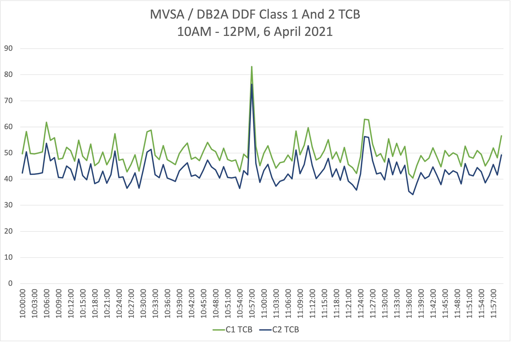
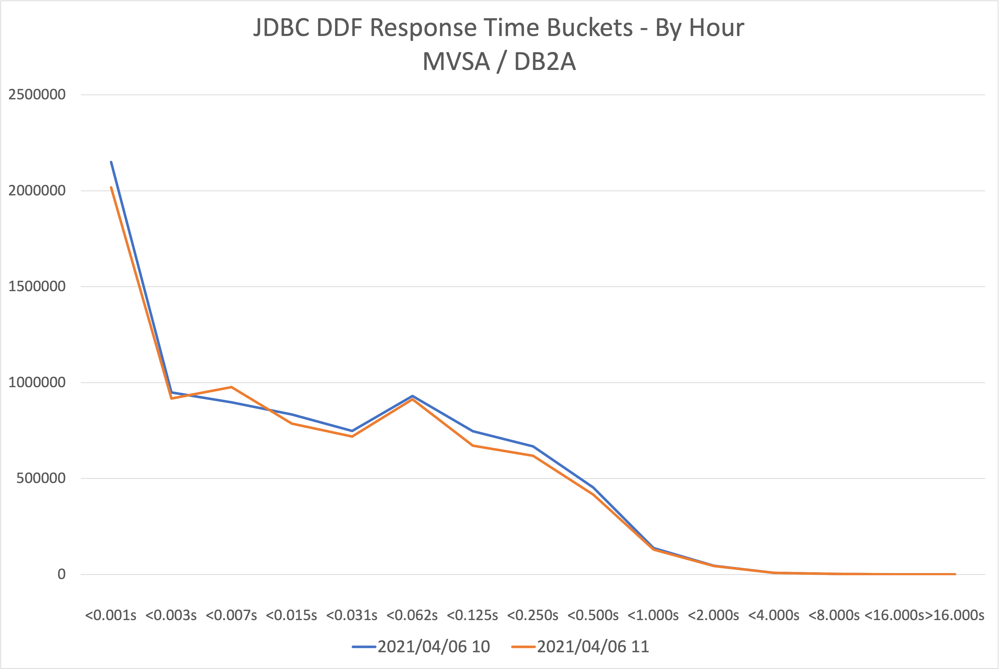

# Db2 DDF Analysis Tool

Db2 DDF Analysis Tool is a set of DFSORT programs to report on Db2 Accounting Trace (SMF 101), specifically for DDF applications.

(When we say "DFSORT", the code has not been tested on any other sort product - but few if any problems are expected. Reports of compatibility would be gratefully received. In the rest of this guide we will use the term "SORT" - for both DFSORT and its competitors.)

**Notes**

1. The code relies on at least Accounting Trace Classes 1, 2, and 3 being enabled in the records.
There is further value in having Package-Level Accounting (Trace Classes 7, 8, and 10) enabled - but this is not required.
2. You will need Db2 installed, or at least the Db2 installation macro library (commonly known as SDSNMACS).
This tool has only (recently) been tested with Db2 Versions 11 and 12, though it has worked previously with Version 10.

## Repository Contents

This repository consists of the following JCL programs:

* One-time installation:
  * ASMEXIT - to assemble an E15 exit that reformats the SMF 101 records. (The $ASM procedure is included for this purpose.)
* Database build:
  * BUILDDB - to read SMF 101 data and, using the exit and SORT to write a number of flat files. These files are what reporting code (generally SORT but could be eg REXX) can run against.
* Reporting:
  * BYMINUTE - to run a 1-step sample program that reports on a single subsystem at a 1-minute level.
  * BYSCLASS - to run a 1-step sample program that reports basic statistics for each WLM Service Class for each Db2 Subsystem ID.
  * BUCKETS - to run queries that create counts of transaction endings by minute and hour as buckets - for CPU and Response Time analysis.
  * SSIDCORR - to run a 2-step sample program that reports Db2 subsystem IDs and correlation IDs.
  * SSIDMIN - to run a 1-step program that reports on all the named Db2 subsystem IDs at the 1-minute level.

The intention is to add more reporting samples, and for users to generate their own. If they'd like to contribute them to this **open source** project that would be great.)

There are also z/OSMF workflows:

* ASMEXIT.xml - to assemble and linkedit the E15 exit used in the database build process.
* BUILDDB.xml - to read the SMF 101 Db2 Accounting Trace records and build the database.

## Installation

To install the code:

1. Download from here.
1. Upload the JCL members to a JCL PDS(E) on the z/OS LPAR you intend to run the code on.
1. Upload the CTL member to another FB80 PDS(E) of your choosing.
1. Edit and submit the ASMEXIT job, assembling and link editing into a load library of your choosing.
`<SDSNMACS>` needs to be changed to point at your Db2 installation macro library.
1. Extract a small set of SMF 101 data and point at it (via SORTIN) in an edited version of the BUILDDB job.
1. Create reporting data sets, as outlined in [Reporting](#reporting).
1. Tailor and run the SSIDCORR sample reporting program - to verify it all works correctly.

All the jobs should return RC=0. The test with the small set of SMF 101 data should suffice for Installation Verification.

"Editing" means finding the variables, denoted by `<...>` and changing them to values that work for you. See [Tailoring](#tailoring) for the variables you will need to alter.

Note the line

    DSN=<HLQ>.<QUAL2>.CTL(DDFIDSYM) 

This member is the SORT Symbols deck (SYMNAMES DD) the build job and reporting jobs will use to map the flat files created by BUILDDB.

## Use

In use there are two distinct phases:

1. Building the flat file database from raw SMF 101 records.
1. Reporting.

### Building The Database

You probably want to build the database more than just on a one-off basis.

Once you've established the BUILDDB job works you can modify it so the SORTIN DD points to an appropriate source.
Likewise you can modify the OUTFIL data sets to point to appropriate targets.

**Note:** If you have turned on Db2's Accounting Trace Compression you will need to decompress the records before passing them to the database build job.
The best way to decompress the data is by assembling, link-editing and running the Db2-supplied DSNTSMFD program. It is in the Db2 SDSNSAMP library.
The most common symptom of running the database build against compressed data is a S0C7 ABEND.

### Preparing For Reporting

Reporting jobs obviously need to point to the right "database" input data sets.

Note again the need to use the edited name for `DSN=<HLQ>.<QUAL2>.CTL(DDFIDSYM)` to map the database data sets.

**Pro Tip:** You can concatenate your own symbols deck after this symbols file.
Generally I use inline symbols, but you can "harden" them in a file of your own.

You will need to allocate a report data set - for reports that cover **all** the Db2 subsystems. It should be a PDS(E) with a LRECL of at least 4096 and a RECFM of VB.

Here's a sample JCL step to allocate the reporting data set.

    //ALDDFRPT EXEC PGM=IEFBR14
    //REPORT   DD DISP=(NEW,CATLG),
    //            SPACE=(CYL,(50,50,20)),UNIT=<UNIT>,
    //            DCB=(RECFM=VB,BLKSIZE=0,LRECL=4096),
    //            DSN=<HLQ>.<QUAL2>.DDF.REPORTS

For some reports you will need to allocate a report data set for reports that cover **a specific** Db2 subsystem. It should be a PDS(E) with a LRECL of at least 4096 and a RECFM of VB.

Here's a sample JCL step to allocate the reporting data set.

    //ALDDFRPT EXEC PGM=IEFBR14
    //REPORT   DD DISP=(NEW,CATLG),
    //            SPACE=(CYL,(50,50,20)),UNIT=<UNIT>,
    //            DCB=(RECFM=VB,BLKSIZE=0,LRECL=4096),
    //            DSN=<HLQ>.<QUAL2>.DDF.<SMFID><SSID>.REPORTS

If you follow the above naming convention sample reporting jobs should be able to allocate it, writing the reports to its members.

**Note:** Because these are RECFM=VB you could make the LRECL even larger than 4096.
There is no space wasted with a long LRECL because the RECFM is VB.

### Sample Reporting jobs

#### SSIDCORR

This is a two step SORT job, showing many of the most useful techniques.
It comprises two steps:

1. SUMSSIDS - Producing a list of Db2 subsystem IDs
1. SUMCORRS - Producting a list of Db2 correlation IDs

The output from this will be two Comma-Separated-Value (CSV) members of the reporting data set - SUMSSIDS and SUMCORRS.
A reasonable step would be to download these and import them into a spreadsheet, where you could sort them on a number of columns and report on them.
(This repository doesn't currently contain any workstation code.)

One technique of note is to concatenate further symbols to the SYMNAMES DD.
The symbols beginning with `_` are as a result of the INREC statement.
To make this work you need to have a `POSITION,1` statement before these symbols.

#### BYMINUTE

This is a single-step job, showing how you can report down at the one minute level. Arbitrary / short time granularity is one of the key benefits of Db2 DDF Analysis Tool.

It creates a CSV member of the reporting data set - BYMINUTE.

One interesting feature is that it reports on SQL statements **sent** separately from SQL statements **received**. So you can see to what degree the Db2 subsystem acts as a client, and to what extent it acts as a server.

A sample CSV file is included - BYMINUTE.csv - together with an Excel spreadsheet - BYMINUTE.xslx.
Embedded in the spreadsheet is a graph saved as BYMINUTE-C1C2-TCB.png.
It looks like this:

#### BYSCLASS

BYSCLASS is a single-step job, reporting basic statistics for each WLM Service Class for each Db2 Subsystem ID.

It creates a flat file member of the reporting data set - BYSCLASS.

The statistics it reports are:

* Record Count
* Commits
* Aborts
* Class 1 TCB (seconds)
* Class 1 zIIP (seconds)
* Class 2 TCB (seconds)
* Class 2 zIIP (seconds)

**Note**: The WLM Service Class is in field QWACWLME, which is only filled in for **inbound DDF** work, no other connection type and not for **outbound** DDF work. \
There is no Service Class Period information in the SMF 101 record.

#### BUCKETS

BUCKETS is a multi-step job. It produces a number of reports:

* RTMIN - Response Time Buckets By Minute
* RTHOUR - Response Time Buckets By Hour
* CPUMIN - Class 1 CPU Time Time Buckets By Minute
* CPUHOUR - Class 1 CPU Time Time Buckets By Hour
* C1C2MIN - Class 1 / 2 Times By Minute
* C1C2HOUR - Class 1 / 2 Times By Hour

The RUNSYMS step that precedes the report generation step allows you to change the bucket boundaries.

This job writes to a subsystem-specific report PDS(E) - so you will need to tailor `<SMFID>` and `<SSID>`. It is also specific to one Correlation ID, so you will need to change `<CORRID>` to the Correlation ID you want to report on.
For example, most JDBC applications have a Correlation ID of "db2jcc\_appli_".

With a little work you could remove the Correlation ID specification, of course. Perhaps you would substitute the QWACWLME field.

A sample CSV file is included - RTHOUR.csv - together with an Excel spreadsheet - RTHOUR.xslx.
Embedded in the spreadsheet is a graph saved as JDBC-RT-Buckets.png.
It looks like this:

This report was created by the RTHOUR step.

#### SSIDMIN

SSIDMIN is a single step job. It produces a single report, showing activity to individual subsystems:

* Up to 8 named SMFID / Subsystem pairs
* Activity in the data to subsystems not named - "Other"

You might use the latter to add to the former.

It's feasible to reduce the number of subsystems, or indeed to increase it. This is quite a fiddly job so editing will need quite a lot of care.

Before you run the job, tailor the `SMFIDn` and `SSIDn` symbols to refer to your subsystems. In this sample the first two are filled in to show you how to do it.

You can also cut down the records processed, for example restricting them to a particular WLM Service Class. Commented out is an `INCLUDE` statement that limits the records to those with Service Class "DDFHOT".

The output is a CSV file. Pulling this into your spreadsheet program you might like to massage the spreadsheet:

* Remove the columns for blank subsystems.
* Edit the timestamps to remove part or all of the date.

From there a simple step would be to create a graph showing the commits per minute by subsystem.

## Tailoring

You will need to globally edit the following variables to suit your environment:

* **&lt;HLQ&gt;** - High Level Qualifier e.g. `PACKER`.
* **&lt;QUAL2&gt;** - Second Level Qualifier e.g. `CLIENTA`. I would not make this more than 1 level as some of the data sets will run out of qualifiers.
* **&lt;SDSNMACS&gt;** - Db2 Macro Library e.g. `DB2.V12.SDSNMACS`.
* **&lt;SMF-Input&gt;** - Input data set with the SMF 101 records in e.g. `PACKER.TEST.SMF.DB2ACCT`.
* **&lt;SYSOUT&gt;** - SYSOUT specification e.g. `K,HOLD=YES`.
* **&lt;UNIT&gt;** - Disk unit e.g. `SYSDA`.

For some reporting jobs you will need to edit two variables to tailor the report to a specific subsystem:

* **&lt;SMFID&gt;** - System SMFID e.g. `SYSA`.
* **&lt;SSID&gt;** - Db2 Subsystem Name e.g. `DB2P`.
